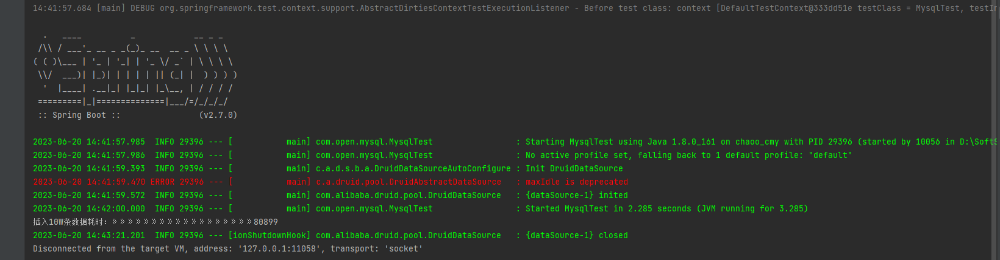
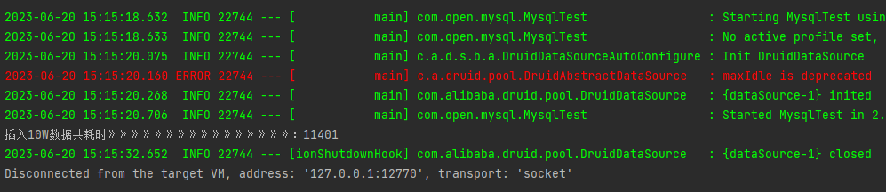
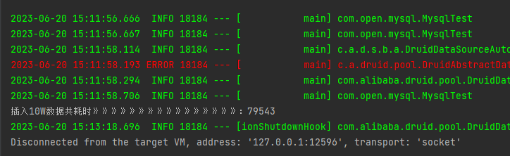
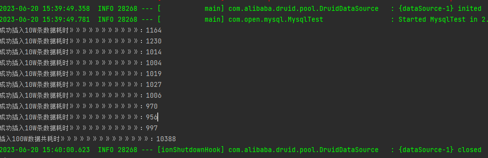
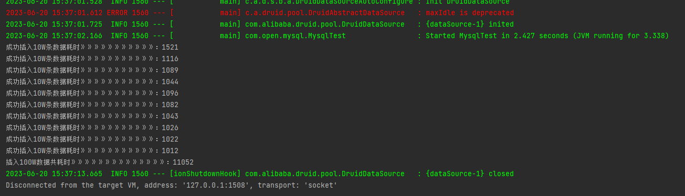
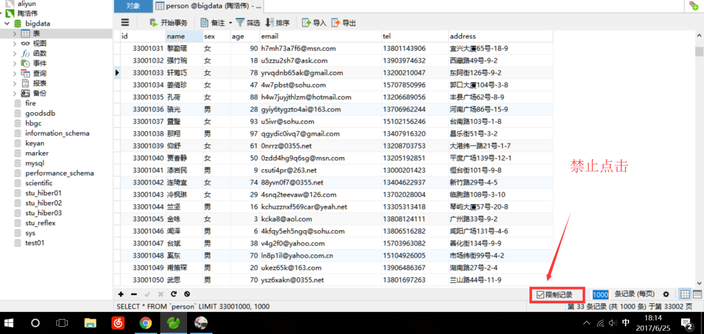
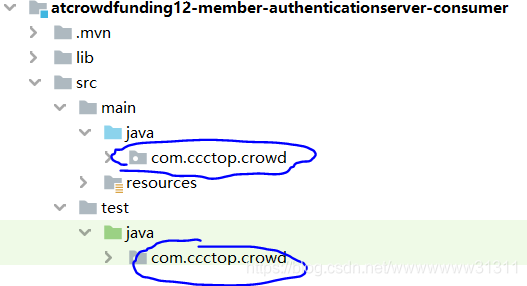
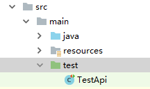

# 测试内容
本次测评一共通过三种策略，五种情况，进行大批量数据插入测试

* 策略分别是：
Mybatis 轻量级框架插入（无事务）
采用JDBC直接处理（开启事务、无事务）
采用JDBC批处理（开启事务、无事务）

* 测试结果：
Mybatis轻量级插入 -> JDBC直接处理 -> JDBC批处理效率最高。
  
# 第一种策略测试：Mybatis 轻量级框架插入（无事务）
Mybatis是一个轻量级框架，它比hibernate轻便、效率高。但是处理大批量的数据插入操作时，需要过程中实现一个ORM的转换，本次测试存在实例，以及未开启事务，导致mybatis效率很一般。
具体实现：利用Spring框架生成mapper实例、创建人物实例对象。循环更改该实例对象属性、并插入。

利用mybatis向mysql插入10万数据耗时：80899，即80.8秒


# 第二种策略测试：采用JDBC直接处理（开启事务、关闭事务）
1、开启事务 
采用JDBC直接处理的策略，这里的实验内容分为开启事务、未开启事务是两种，过程均如下： 
* 利用PreparedStatment预编译
* 循环，插入对应数据，并存入 
  
事务对于插入数据有多大的影响呢？ 看下面的实验结果:
开启事务后插入10W条数据需要耗时多少：11401，即11.4秒


2、关闭事务
测试无事务状态下，插入10W条数据需要耗时多少：79543，即79.5秒


# 第三种策略测试：采用JDBC批处理（开启事务、无事务）
采用JDBC批处理时需要注意一下几点：
1.在URL连接时需要开启批处理、以及预编译
```yaml
String url = “jdbc:mysql://localhost:3306/User?rewriteBatched
-Statements=true&useServerPrepStmts=false”;
```
2.PreparedStatement预处理sql语句必须放在循环体外
```java
    //定义连接、statement对象
    Connection conn = null;
    PreparedStatement pstm = null;
    try{}catch(Exception e){}
```

1、开启事务
有事务，每次循环插入10W条数据，循环10次，一共100W条数据。
实验结果：使用JDBC批处理，未开启事务下，平均每2.1秒插入十万条数据。100w数据总耗时：10.3秒


2、关闭事务
无事务，每次循环插入10W条数据，循环10次，一共100W条数据。
实验结果：使用JDBC批处理，未开启事务下，平均每1.1秒插入十万条数据。100w数据总耗时：11.05秒



# 总结
能够看到，在开启事务下 JDBC直接处理 和 JDBC批处理 均耗时更短。

Mybatis 轻量级框架插入 , mybatis在我这次实验被黑的可惨了，哈哈。实际开启事务以后，差距不会这么大（差距10倍）。大家有兴趣的可以接着去测试

JDBC直接处理，在本次实验，开启事务和关闭事务，耗时差距5倍左右，并且这个倍数会随着数据量的增大而增大。因为在未开启事务时，更新10000条数据，就得访问数据库10000次。导致每次操作都需要操作一次数据库。

JDBC批处理，在本次实验，开启事务与关闭事务，耗时差距很微小（后面会增加测试，加大这个数值的差距）。但是能够看到开启事务以后，速度还是有提升。

结论：设计到大量单条数据的插入，使用JDBC批处理和事务混合速度最快。实测使用批处理+事务混合插入1亿条数据耗时：174756毫秒

# 补充
JDBC批处理事务，开启和关闭事务，测评插入20次，一次50W数据，一共一千万数据耗时：
1、开启事务(数据太长不全贴了)
插入1000W数据共耗时：197654
2、关闭事务(数据太长不全贴了)
插入1000W数据共耗时：200540

# 注意事项


# SpringBoot集成Mybatis注意：
SpringBoot 五种获取ApplicationContext的方式
https://blog.csdn.net/penriver/article/details/117028346

java.lang.IllegalStateException: Unable to find a @SpringBootConfiguration, you need to use @ContextConfiguration or @SpringBootTest(classes=…) with your test
解决：修改包名一致，如图

@SpringBootTest(classes = MysqlDemoApplication.class)

springboot中测试类使用@Autowired空指针处理方案
解决：src目录下面创建test文件夹，并标注为测试资源，然后创建测试类：TestApi，@Test为手动导入 import org.junit.jupiter.api.Test;

https://blog.csdn.net/weixin_43401380/article/details/123979451

springboot集成mybatis
https://juejin.cn/post/7225573912670748733

SpringBoot启动类中使用 @MapperScan注解介绍
https://blog.csdn.net/qq_37748331/article/details/115245800

Springboot +Mybatis整合常见错误 数据源datasource报错：Property ‘sqlSessionFactory‘ or ‘sqlSessionTemplate‘ are required
https://www.jianshu.com/p/d96a53b77713
https://www.cnblogs.com/mkl34367803/p/11218082.html
https://blog.csdn.net/lvoelife/article/details/128033433
