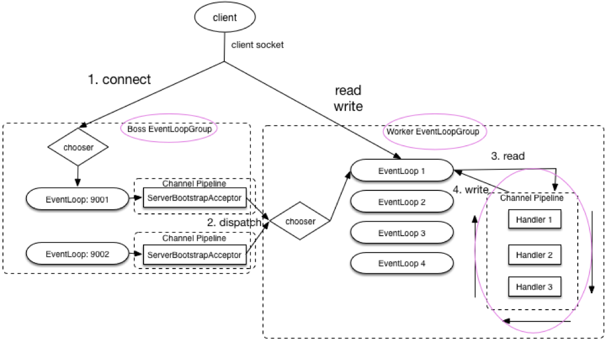
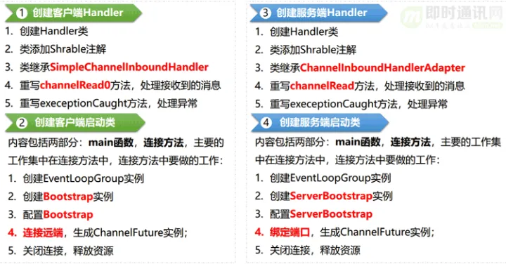

# Netty 是什么

1. Netty 是⼀个 基于 NIO 的 client-server(客户端服务器)框架，使⽤它可以快速简单地开发⽹络应⽤程序。
   
2. 它极⼤地简化并优化了 TCP 和 UDP 套接字服务器等⽹络编程,并且性能以及安全性等很多⽅⾯甚⾄都要更好。
   
3. ⽀持多种协议 如 FTP， SMTP， HTTP 以及各种⼆进制和基于⽂本的传统协议。

# 为什么要用 Netty

因为 Netty 具有下⾯这些优点，并且相⽐于直接使⽤ JDK ⾃带的 NIO 相关的 API 来说更加易⽤。

# Netty 应用场景了解么

1、作为 RPC 框架的⽹络通信⼯具 ： 我们在分布式系统中，不同服务节点之间经常需要相互调⽤，这个时候就需要 RPC 框架。

2、实现⼀个⾃⼰的 HTTP 服务器 ：通过 Netty 我们可以⾃⼰实现⼀个简单的 HTTP 服务器。 

3、实现⼀个即时通讯系统 ： 使⽤ Netty 我们可以实现⼀个可以聊天类似微信的即时通讯系统。

4、实现消息推送系统 ：市⾯上有很多消息推送系统都是基于 Netty 来做的。

# Netty 核心组件有哪些？分别有什么作用？
1）I/O：各种各样的流（文件、数组、缓冲、管道。。。）的处理（输入输出）；
2）Channel：通道，代表一个连接，每个Client请对会对应到具体的一个Channel；
3）ChannelPipeline：责任链，每个Channel都有且仅有一个ChannelPipeline与之对应，里面是各种各样的Handler；
4）handler：用于处理出入站消息及相应的事件，实现我们自己要的业务逻辑；
5）EventLoopGroup：I/O线程池，负责处理Channel对应的I/O事件；
6）ServerBootstrap：服务器端启动辅助对象；
7）Bootstrap：客户端启动辅助对象；
8）ChannelInitializer：Channel初始化器；
9）ChannelFuture：代表I/O操作的执行结果，通过事件机制，获取执行结果，通过添加监听器，执行我们想要的操作；
10）ByteBuf：字节序列，通过ByteBuf操作基础的字节数组和缓冲区。

# netty 核心架构图


# Netty 线程模型了解么
Reactor 模式基于事件驱动，采⽤多路复⽤将事件分发给相应的 Handler 处理，⾮常适合处理海量 IO 的场景。
单线程
多线程
主从线程

# Netty 服务端和客户端的启动过程了解么？



服务端启动过程：
```java
// 1.bossGroup ⽤于接收连接， workerGroup ⽤于具体的处理
EventLoopGroup bossGroup = new NioEventLoopGroup(1);
        EventLoopGroup workerGroup = new NioEventLoopGroup();
        try {
//2.创建服务端启动引导/辅助类： ServerBootstrap
        ServerBootstrap b = new ServerBootstrap();
//3.给引导类配置两⼤线程组,确定了线程模型
        b.group(bossGroup, workerGroup)
// (⾮必备)打印⽇志
        .handler(new LoggingHandler(LogLevel.INFO))
// 4.指定 IO 模型
        .channel(NioServerSocketChannel.class)
        .childHandler(new ChannelInitializer<SocketChannel>
() {
@Override
public void initChannel(SocketChannel ch) {
        ChannelPipeline p = ch.pipeline();
//5.可以⾃定义客户端消息的业务处理逻辑
        p.addLast(new HelloServerHandler());
        }
        });
// 6.绑定端⼝,调⽤ sync ⽅法阻塞知道绑定完成
        ChannelFuture f = b.bind(port).sync();
// 7.阻塞等待直到服务器Channel关闭(closeFuture()⽅法获取
        Channel 的CloseFuture对象,然后调⽤sync()⽅法)
        f.channel().closeFuture().sync();
        } finally {
//8.优雅关闭相关线程组资源
        bossGroup.shutdownGracefully();
        workerGroup.shutdownGracefully();
        }
```

客户端启动过程：
```java
//1.创建⼀个 NioEventLoopGroup 对象实例
EventLoopGroup group = new NioEventLoopGroup();
try {
//2.创建客户端启动引导/辅助类： Bootstrap
Bootstrap b = new Bootstrap();
//3.指定线程组
b.group(group)
//4.指定 IO 模型
.channel(NioSocketChannel.class)
.handler(new ChannelInitializer<SocketChannel>() {
@Override
public void initChannel(SocketChannel ch) throws
Exception {
ChannelPipeline p = ch.pipeline();
// 5.这⾥可以⾃定义消息的业务处理逻辑
p.addLast(new HelloClientHandler(message));
}
});
// 6.尝试建⽴连接
ChannelFuture f = b.connect(host, port).sync();
// 7.等待连接关闭（阻塞，直到Channel关闭）
f.channel().closeFuture().sync();
} finally {
group.shutdownGracefully();
}
```

# 什么是 TCP 粘包/拆包?有什么解决办法呢？
1.使⽤ Netty ⾃带的解码器
LineBasedFrameDecoder、DelimiterBasedFrameDecoder、FixedLengthFrameDecoder、LengthFieldBasedFrameDecoder
2.⾃定义序列化编解码器
专⻔针对 Java 语⾔的： Kryo， FST 等等
跨语⾔的： Protostuff（基于 protobuf 发展⽽来）， ProtoBuf， Thrift， Avro， MsgPack 等等

# Netty 长连接、心跳机制了解么？
⼼跳机制的⼯作原理是: 在 client 与 server 之间在⼀定时间内没有数据交互时, 即处于 idle 状态
时, 客户端或服务器就会发送⼀个特殊的数据包给对⽅, 当接收⽅收到这个数据报⽂后, 也⽴即发送⼀
个特殊的数据报⽂, 回应发送⽅, 此即⼀个 PING-PONG 交互。

TCP 协议层⾯的⻓连接灵活性不够。所以，⼀般情况下我们都是在应⽤层协议上实现⾃定义⼼跳
机制的，也就是在 Netty 层⾯通过编码实现。通过 Netty 实现⼼跳机制的话，核⼼类是
IdleStateHandler

# Netty 的零拷贝了解么？
在 OS 层⾯上的 Zero-copy 通常指避免在 ⽤户态(User-space) 与 内核态(Kernel-space)
之间来回拷⻉数据。⽽在 Netty 层⾯ ，零拷⻉主要体现在对于数据操作的优化。

Netty 中的零拷⻉体现在以下⼏个⽅⾯
1. 使⽤ Netty 提供的 CompositeByteBuf 类, 可以将多个 ByteBuf 合并为⼀个逻辑上的
   ByteBuf , 避免了各个 ByteBuf 之间的拷⻉。
2. ByteBuf ⽀持 slice 操作, 因此可以将 ByteBuf 分解为多个共享同⼀个存储区域的
   ByteBuf , 避免了内存的拷⻉。
3. 通过 FileRegion 包装的 FileChannel.tranferTo 实现⽂件传输, 可以直接将⽂件缓冲
   区的数据发送到⽬标 Channel , 避免了传统通过循环 write ⽅式导致的内存拷⻉问题.
   
# 实践项目
使用 Netty+SpringBoot 打造的 TCP 长连接通讯方案！
https://mp.weixin.qq.com/s/D9FNvs7AUCBaFy75X2ox-g


# 参考链接
https://zhuanlan.zhihu.com/p/299396057
https://zhuanlan.zhihu.com/p/181239748
https://juejin.cn/post/6844903703183360008
